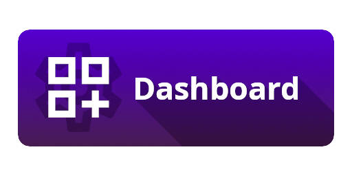
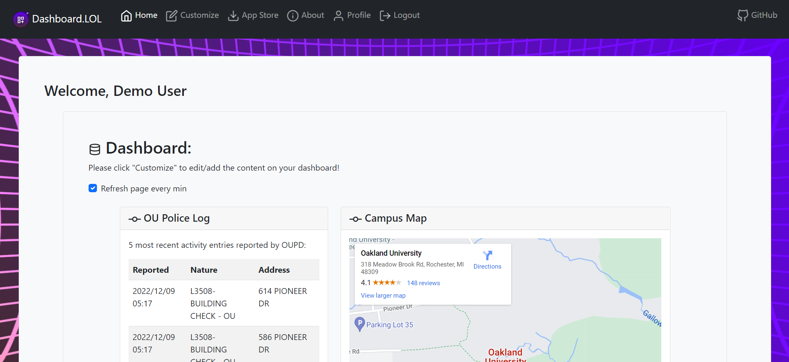
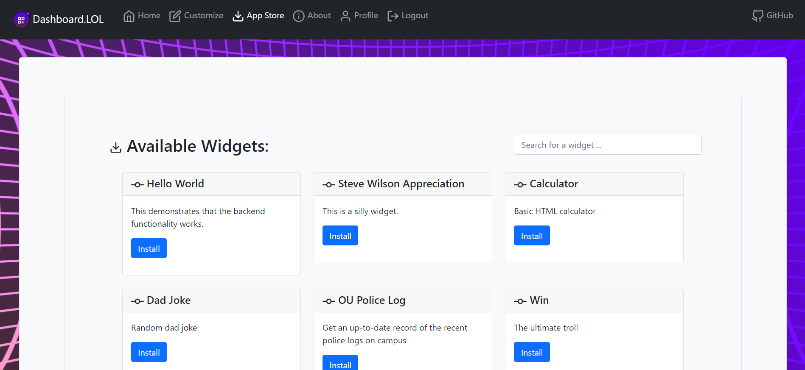
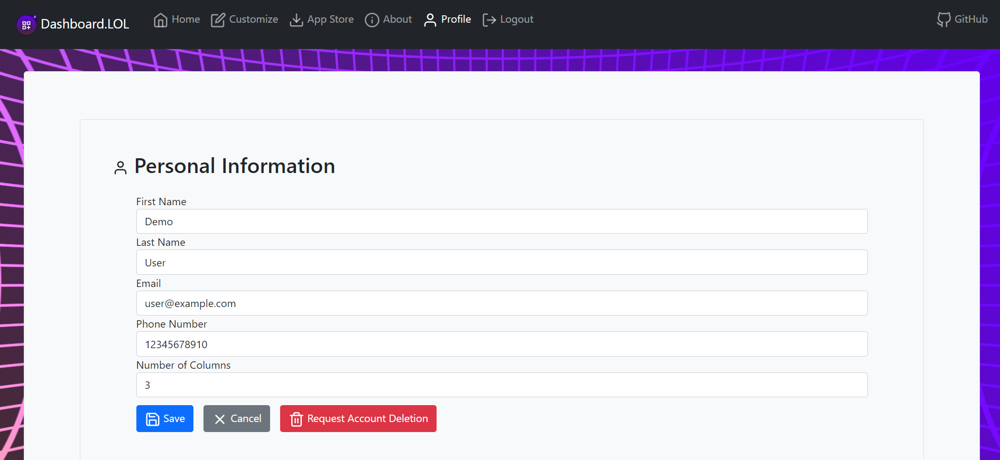
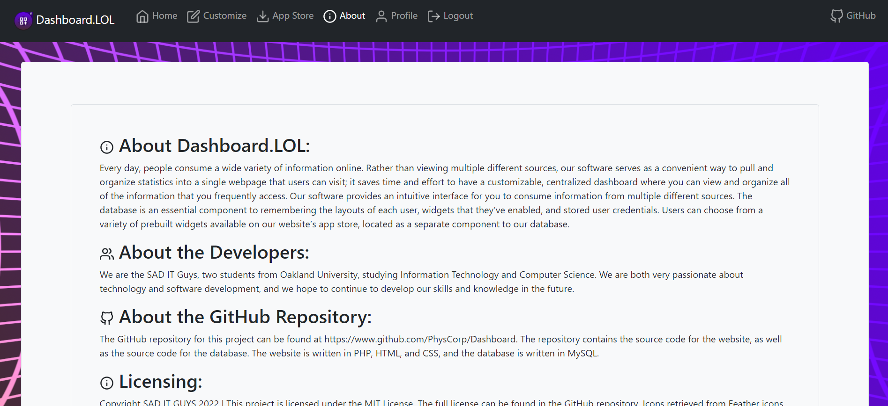

# Dashboard.LOL
A customizable frontend for your data-driven applications! Check out our sample configuration!

## Background
Every day, people consume a wide variety of information online. Rather than viewing multiple different sources, our software serves as a convenient way to pull and organize statistics into a single webpage that users can visit; it saves time and effort to have a customizable, centralized dashboard where you can view and organize all of the information that you frequently access. Our software provides an intuitive interface for you to consume information from multiple different sources. The database is an essential component to remembering the layouts of each user, widgets that they’ve enabled, and stored user credentials. Users can choose from a variety of prebuilt widgets available on our website’s app store, located as a separate component to our database

## Features
- App store that allows you to choose which widgets to install/remove.
- Customizable widgets that can be added to your dashboard, such as:
  - Time and date
  - WEPA Printer availability
  - Recent news articles
  - Motivational quotes
  - and more!

# Directory Structure
`actions` - Contains all of the PHP files that handle user actions, such as logging in, signing up, and logging out.
`css` - Contains all of the CSS files that style the web pages.
`img` - Contains all of the images used in the web pages.
`js` - Contains all of the JavaScript files that handle the dynamic functionality of the web pages.
`misc` - Contains miscellaneous files, such as the Icon, Header, and Favicon files for editing in GIMP.
`private` - Contains all of the files that are not accessible to the public, such as the database configuration file and the HTML widgets directory.
`promotional` - Contains all of the promotional images used in this README.
`python` - Contains some Python scripts for adding widgets to the app store and posting HTML to the database.
`setup` - Contains the database setup file, as well as a script to link this directory to Bitnami WAMP (Windows only).
`/` - Contains all of the web pages, such as the login page, the dashboard page, and the app store page, as well as our presentation, ERD, and license.

## Usage
### Login
1. Navigate to the `login.php` file in the root directory of the web server.
2. Enter your username and password.
3. Click the `Login` button.

### Sign Up
1. Navigate to the `signup.php` file in the root directory of the web server.
2. Enter your username, password, first name, last name, email, and phone number.
3. Click the `Sign Up` button.

### Dashboard
1. Click the `Dashboard` button in the top left corner of the page.
2. View your widgets.
3. Click the `Refresh page every min` button to toggle automatic page refreshes.

### App Store
1. Click the `App Store` button in the top left corner of the page.
2. View the available widgets.
3. Click the `Install` button to install a widget.
4. Click the `Remove` button to remove a widget.

### Personal Info
1. Click the `Personal Info` button in the top left corner of the page.
2. View and edit your personal information.
3. Click the `Request Account Deletion` button to request that your account be deleted.

### About
1. Click the `About` button in the top left corner of the page.
2. View information about the developers.

### Logout
1. Click the `Logout` button in the top right corner of the page to log out.

## Installation
### Prerequisites/Requirements
- Ubuntu 20.04 or CentOS 7, or newer. Your mileage may vary with other distributions.
- Preferably 2GB of RAM or more for both the web server and database.
- A web server with PHP 7.4 or newer and MySQL 8.0 or newer. We recommend using a LAMP stack (detailed below).
- LAMP stack setup. If you don't have one, you can follow this tutorial: https://www.digitalocean.com/community/tutorials/how-to-install-linux-apache-mysql-php-lamp-stack-on-ubuntu-20-04
- Python 3.8 or newer. You can install it with `sudo apt install python3` on Ubuntu or `sudo yum install python3` on CentOS.

### Setup
1. Clone the repository to your web server's root directory (or any other directory you want to run the application from). An example directory is `/var/www/html/dashboard`.
2. Create a database named `dashboard_lol` and import the `db_setup.sql` file found in the `setup` directory.
3. Create a user named `dashboard_agent` with the password `thedashboardliveson` and grant all privileges to the `dashboard` database. Alternatively, give a username and password of your choice.
4. Change the parameters in the `db_config.json` file from `private` to the appropriate values for your database.

### Configuration
1. To add a new widget to the app store, run the `add-app.py` file in the `python` folder.
2. To post HTML to your new widget, run the `post-to-widget.py` file in the `python` folder, which will post each `.html` file in the `private/widgets` directory to the database.
* There is also a convenient `reload-all-apps.py` file in `python` directory that will invoke all of your Python-based widgets in the `python/widgets` directory.

## About the Developers
We are the SAD IT Guys, two students from Oakland University, studying Information Technology and Computer Science. We are both very passionate about technology and software development, and we hope to continue to develop our skills and knowledge in the future.

## License
Copyright SAD IT GUYS 2022 | This project is licensed under the MIT License. The full license can be found in the GitHub repository. Icons retrieved from Feather icons, which is under the MIT license.

